# LogoBot
# Assembly Guide

## Bill of Materials

Make sure you have all of the following parts before you begin.

### Vitamins

Qty | Vitamin | Image
--- | --- | ---
1 | [Breadboard 170]() |  | 
2 | [JumperWire Female to Male 4pin 100mm]() |  | 
1 | [16mm Marble]() |  | 

### Printed Parts

Qty | Part Name | Image
--- | --- | ---
1 | [Basic Shell](../printedparts/stl/BasicShell.stl) |  | 
2 | [Bumper](../printedparts/stl/Bumper.stl) |  | 
1 | [Lid](../printedparts/stl/Lid.stl) |  | 
1 | [Base](../printedparts/stl/Base.stl) |  | 
1 | [Caster Housing](../printedparts/stl/CasterHousing.stl) |  | 
2 | [Wheel](../printedparts/stl/Wheel.stl) |  | 
4 | [Pintack H14.1 BH2](../printedparts/stl/PintackH141BH2.stl) |  | 
1 | [Pintack H6.1 BH2](../printedparts/stl/PintackH61BH2.stl) |  | 

## Brain

### Vitamins

Qty | Vitamin | Image
--- | --- | ---
1 | [Breadboard 170]() |  | 

### Assembly Steps

1. Push the Arduino onto the breadboard - make sure you position it correctly,                  as it's a tight fit with the Robot base!

## Bumpers (x2)

### Printed Parts

Qty | Part Name | Image
--- | --- | ---
2 | [Bumper](../printedparts/stl/Bumper.stl) |  | 

### Assembly Steps

1. Place the Microswitches into the holders.  Make sure to get them the right way round so the bumper hits the metal lever.  Repeat for the second bumper.
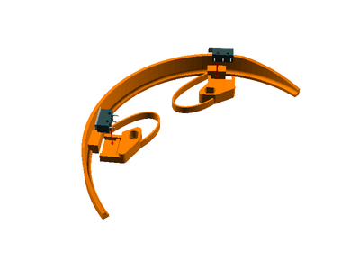

## Drive Wheel (x2)

### Printed Parts

Qty | Part Name | Image
--- | --- | ---
2 | [Wheel](../printedparts/stl/Wheel.stl) |  | 

### Assembly Steps

1. Push the wheel onto the motor shaft **Optional:** add a rubber band to the wheel for extra grip.

## Rear Caster

### Vitamins

Qty | Vitamin | Image
--- | --- | ---
1 | [16mm Marble]() |  | 

### Printed Parts

Qty | Part Name | Image
--- | --- | ---
1 | [Caster Housing](../printedparts/stl/CasterHousing.stl) |  | 

### Assembly Steps

1. Insert the marble into the printed housing
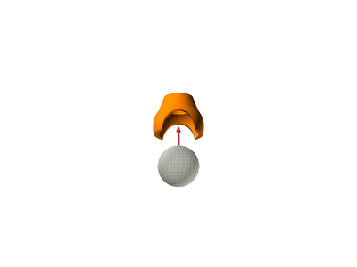

## Shell

### Printed Parts

Qty | Part Name | Image
--- | --- | ---
1 | [Basic Shell](../printedparts/stl/BasicShell.stl) |  | 
1 | [Lid](../printedparts/stl/Lid.stl) |  | 

### Assembly Steps

1. Clip the lid onto the top of the shell
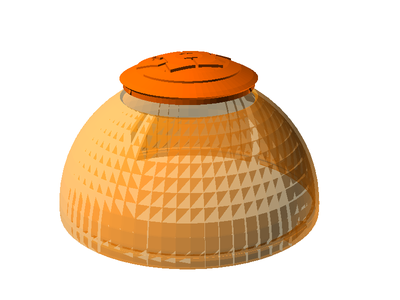

## Final Assembly

### Vitamins

Qty | Vitamin | Image
--- | --- | ---
2 | [JumperWire Female to Male 4pin 100mm]() |  | 

### Printed Parts

Qty | Part Name | Image
--- | --- | ---
1 | [Base](../printedparts/stl/Base.stl) |  | 
4 | [Pintack H14.1 BH2](../printedparts/stl/PintackH141BH2.stl) |  | 
1 | [Pintack H6.1 BH2](../printedparts/stl/PintackH61BH2.stl) |  | 

### Sub-Assemblies

Qty | Name 
--- | --- 
1 | Brain
2 | Bumpers
2 | Drive Wheel
1 | Rear Caster
1 | Shell

### Assembly Steps

1. Connect the breadboard assembly to the underside of the base
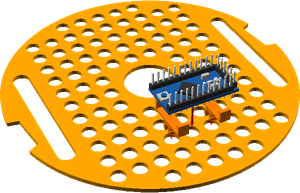
2. Connect the two bumper assemblies using four of the push pins with flat heads
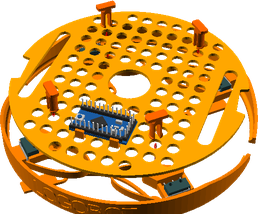
3. Push the two motor drivers onto the mounting posts

4. Clip the two wheels assemblies onto the base and                    connect the motor leads to the the motor drivers

5. Connect the jumper wires between the motor drivers and the Arduino
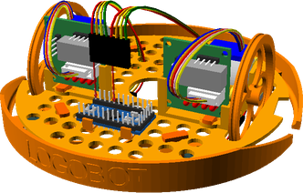
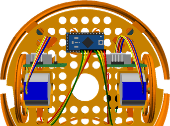
6. Clip in the battery pack
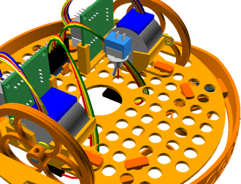
7. Clip the power switch into place
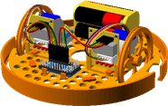
8. Clip the LED into place
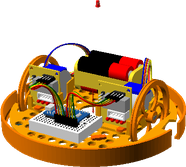
9. Clip the piezo sounder into place
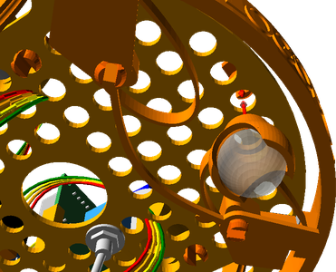
10. Align the caster assembly with the base

11. Insert a short pin to lock the caster assembly to the base
12. Push the shell down onto the base and twist to lock into place
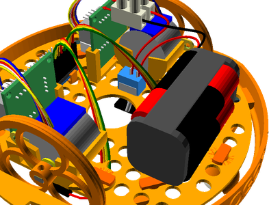

