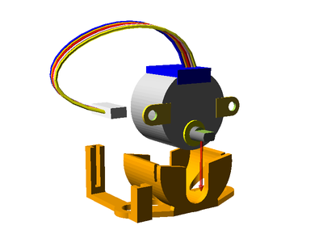
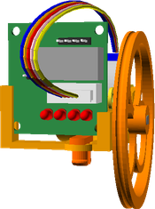
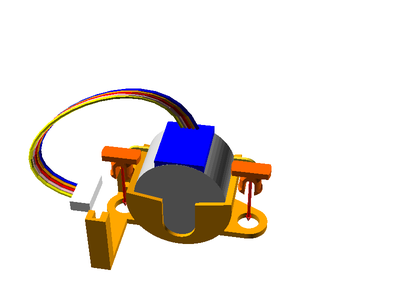
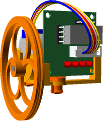
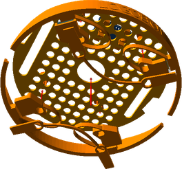
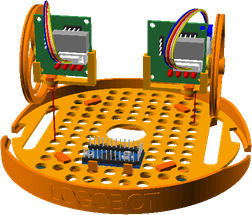
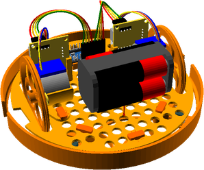
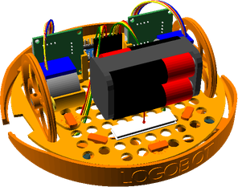

# LogoBot
# Assembly Guide

## Bill of Materials

Make sure you have all of the following parts before you begin.

### Vitamins

Qty | Vitamin | Image
--- | --- | ---
1 | [Arduino Pro Mini Pins on top, inc serial pins]() |  | 
2 | [JumperWire Female to Female 4pin 100mm]() |  | 
1 | [16mm Marble]() |  | 
4 | [MicroSwitch]() |  | 
1 | [SPST6A Mini Toggle Switch]() |  | 
2 | [28YBJ48 Stepper Motor]() |  | 
2 | [ULN2003 Driver Board]() |  | 

### Printed Parts

Qty | Part Name | Image
--- | --- | ---
1 | [Basic Shell](../printedparts/stl/BasicShell.stl) |  | 
2 | [BumperStabiliser](../printedparts/stl/BumperStabiliser.stl) |  | 
2 | [Bumper](../printedparts/stl/Bumper.stl) |  | 
1 | [Left Motor Clip](../printedparts/stl/LeftMotorClip.stl) |  | 
1 | [Lid](../printedparts/stl/Lid.stl) |  | 
1 | [Base](../printedparts/stl/Base.stl) |  | 
1 | [Caster Housing](../printedparts/stl/CasterHousing.stl) |  | 
4 | [Pin Tack H14.1](../printedparts/stl/PinTackH141.stl) |  | 
1 | [Pin Tack H6.1](../printedparts/stl/PinTackH61.stl) |  | 
4 | [Pin Tack H7](../printedparts/stl/PinTackH7.stl) |  | 
2 | [Pro Mini Clip](../printedparts/stl/ProMiniClip.stl) |  | 
1 | [Right Motor Clip](../printedparts/stl/RightMotorClip.stl) |  | 
2 | [Wheel](../printedparts/stl/Wheel.stl) |  | 

**Plastic Required**

3493.4cm3, 0.19KG,  approx: 2.5 GBP

# Assembly Instructions

## Bumpers (x2)

### Vitamins

Qty | Vitamin | Image
--- | --- | ---
4 | [MicroSwitch]() |  | 

### Printed Parts

Qty | Part Name | Image
--- | --- | ---
2 | [Bumper](../printedparts/stl/Bumper.stl) |  | 

### Assembly Steps

1. Place the Microswitches into the holders.  Make sure to get them the right way round so the bumper hits the metal lever.  Repeat for the second bumper.

## Left Drive Wheel

### Vitamins

Qty | Vitamin | Image
--- | --- | ---
1 | [28YBJ48 Stepper Motor]() |  | 
1 | [ULN2003 Driver Board]() |  | 

### Printed Parts

Qty | Part Name | Image
--- | --- | ---
1 | [Left Motor Clip](../printedparts/stl/LeftMotorClip.stl) |  | 
2 | [Pin Tack H7](../printedparts/stl/PinTackH7.stl) |  | 
1 | [Wheel](../printedparts/stl/Wheel.stl) |  | 

### Assembly Steps

1. Clip the motor into place

2. Push the pins into the motor clip

3. Push the wheel onto the motor shaft, then add a rubber band or o-ring to the wheel for extra grip.  You can also add a retaining grub screw if necessary.

4. Slide the stepper driver into place and plug in the cable for the motor

## Right Drive Wheel

### Vitamins

Qty | Vitamin | Image
--- | --- | ---
1 | [28YBJ48 Stepper Motor]() |  | 
1 | [ULN2003 Driver Board]() |  | 

### Printed Parts

Qty | Part Name | Image
--- | --- | ---
2 | [Pin Tack H7](../printedparts/stl/PinTackH7.stl) |  | 
1 | [Right Motor Clip](../printedparts/stl/RightMotorClip.stl) |  | 
1 | [Wheel](../printedparts/stl/Wheel.stl) |  | 

### Assembly Steps

1. Clip the motor into place

2. Push the pins into the motor clip

3. Push the wheel onto the motor shaft, then add a rubber band or o-ring to the wheel for extra grip.  You can also add a retaining grub screw if necessary.

4. Slide the stepper driver into place and plug in the cable for the motor

## Rear Caster

### Vitamins

Qty | Vitamin | Image
--- | --- | ---
1 | [16mm Marble]() |  | 

### Printed Parts

Qty | Part Name | Image
--- | --- | ---
1 | [Caster Housing](../printedparts/stl/CasterHousing.stl) |  | 

### Assembly Steps

1. Insert the marble into the printed housing

## Shell

### Printed Parts

Qty | Part Name | Image
--- | --- | ---
1 | [Basic Shell](../printedparts/stl/BasicShell.stl) |  | 
1 | [Lid](../printedparts/stl/Lid.stl) |  | 

### Assembly Steps

1. Clip the lid onto the top of the shell

## Final Assembly

### Vitamins

Qty | Vitamin | Image
--- | --- | ---
1 | [Arduino Pro Mini Pins on top, inc serial pins]() |  | 
2 | [JumperWire Female to Female 4pin 100mm]() |  | 
1 | [SPST6A Mini Toggle Switch]() |  | 

### Printed Parts

Qty | Part Name | Image
--- | --- | ---
2 | [BumperStabiliser](../printedparts/stl/BumperStabiliser.stl) |  | 
1 | [Base](../printedparts/stl/Base.stl) |  | 
4 | [Pin Tack H14.1](../printedparts/stl/PinTackH141.stl) |  | 
1 | [Pin Tack H6.1](../printedparts/stl/PinTackH61.stl) |  | 
2 | [Pro Mini Clip](../printedparts/stl/ProMiniClip.stl) |  | 

### Sub-Assemblies

Qty | Name 
--- | --- 
2 | Bumpers
1 | Left Drive Wheel
1 | Right Drive Wheel
1 | Rear Caster
1 | Shell

### Assembly Steps

1. Plug the Pro Mini Clips into the base and then snap the Arduino Pro Mini into them

2. Connect the two bumper assemblies using four of the push pins with flat heads

4. Plug the two wheels assemblies into the base

5. Connect the jumper wires between the motor drivers and the Arduino

6. Fix the power toggle switch into place

9. Align the caster assembly with the base, then insert a short pin to lock it to the base

10. Attach the battery pack with velcro

11. Push the shell down onto the base and twist to lock into place

