# LogoBot IR Seeker
# Assembly Guide

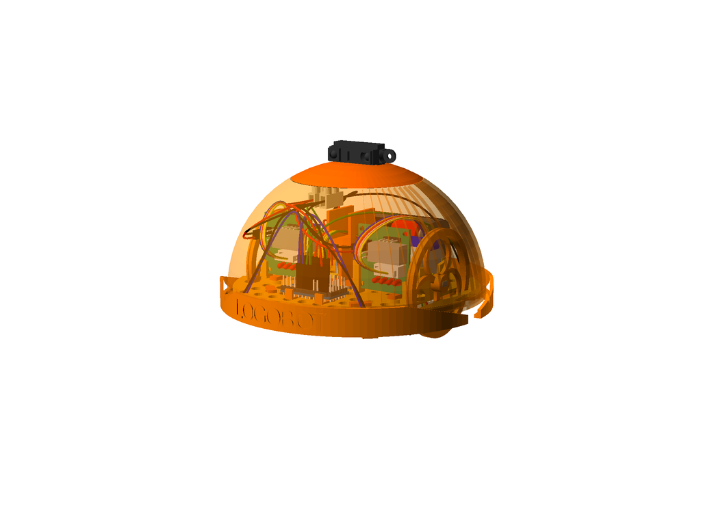

## Bill of Materials

Make sure you have all of the following parts before you begin.

### Vitamins

Qty | Vitamin | Image
--- | --- | ---
1 | [Arduino Pro Mini Pins on top, inc serial pins]() |  | 
4 | [AA Battery]() |  | 
1 | [Battery Pack]() |  | 
1 | [Hook and Loop Tape 40x10mm]() |  | 
2 | [JumperWire Female to Female 4pin 100mm]() |  | 
6 | [JumperWire Female to None 1pin 100mm]() |  | 
4 | [JumperWire Female to None 1pin 70mm]() |  | 
4 | [JumperWire None to None 1pin 100mm]() |  | 
3 | [JumperWire None to None 1pin 50mm]() |  | 
8 | [3mm LED]() |  | 
1 | [16mm Marble]() |  | 
1 | [9g Micro Servo]() |  | 
4 | [MicroSwitch]() |  | 
1 | [SPST6A Mini Toggle Switch]() |  | 
1 | [Servo Horn]() |  | 
1 | [Sharp2Y0A21]() |  | 
2 | [28YBJ48 Stepper Motor]() |  | 
1 | [2 Pole 20A Terminal Block]() |  | 
2 | [ULN2003 Driver Board]() |  | 

### Printed Parts

Qty | Part Name | Image
--- | --- | ---
1 | [Basic Shell](../printedparts/stl/BasicShell.stl) |  | 
2 | [BumperStabiliser](../printedparts/stl/BumperStabiliser.stl) |  | 
2 | [Bumper](../printedparts/stl/Bumper.stl) |  | 
1 | [IR Servo Bracket](../printedparts/stl/IRServoBracket.stl) |  | 
1 | [Left Motor Clip](../printedparts/stl/LeftMotorClip.stl) |  | 
1 | [LidIR](../printedparts/stl/LidIR.stl) |  | 
1 | [Base](../printedparts/stl/Base.stl) |  | 
1 | [Caster Housing](../printedparts/stl/CasterHousing.stl) |  | 
4 | [Pin Tack H14.1](../printedparts/stl/PinTackH141.stl) |  | 
1 | [Pin Tack H6.1](../printedparts/stl/PinTackH61.stl) |  | 
2 | [Pin Tack H6.5](../printedparts/stl/PinTackH65.stl) |  | 
4 | [Pin Tack H7](../printedparts/stl/PinTackH7.stl) |  | 
2 | [Pro Mini Clip](../printedparts/stl/ProMiniClip.stl) |  | 
1 | [Right Motor Clip](../printedparts/stl/RightMotorClip.stl) |  | 
2 | [Wheel](../printedparts/stl/Wheel.stl) |  | 

**Plastic Required**

159.1cm3, 0.2KG,  approx: 2.59 GBP

# Assembly Instructions

## Bumpers (x2)

### Vitamins

Qty | Vitamin | Image
--- | --- | ---
4 | [MicroSwitch]() |  | 

### Printed Parts

Qty | Part Name | Image
--- | --- | ---
2 | [Bumper](../printedparts/stl/Bumper.stl) |  | 

### Assembly Steps

1. Place the Microswitches into the holders.  Make sure to get them the right way round so the bumper hits the metal lever.  Repeat for the second bumper.

## Left Drive Wheel

### Vitamins

Qty | Vitamin | Image
--- | --- | ---
1 | [28YBJ48 Stepper Motor]() |  | 
1 | [ULN2003 Driver Board]() |  | 

### Printed Parts

Qty | Part Name | Image
--- | --- | ---
1 | [Left Motor Clip](../printedparts/stl/LeftMotorClip.stl) |  | 
2 | [Pin Tack H7](../printedparts/stl/PinTackH7.stl) |  | 
1 | [Wheel](../printedparts/stl/Wheel.stl) |  | 

### Assembly Steps

1. Clip the motor into place

2. Push the pins into the motor clip
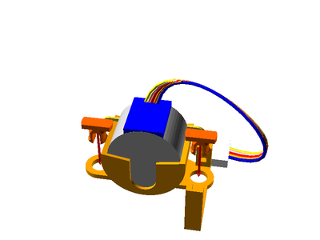
3. Push the wheel onto the motor shaft, then add a rubber band or o-ring to the wheel for extra grip.  You can also add a retaining grub screw if necessary.
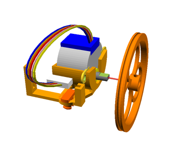
4. Slide the stepper driver into place and plug in the cable for the motor

## Right Drive Wheel

### Vitamins

Qty | Vitamin | Image
--- | --- | ---
1 | [28YBJ48 Stepper Motor]() |  | 
1 | [ULN2003 Driver Board]() |  | 

### Printed Parts

Qty | Part Name | Image
--- | --- | ---
2 | [Pin Tack H7](../printedparts/stl/PinTackH7.stl) |  | 
1 | [Right Motor Clip](../printedparts/stl/RightMotorClip.stl) |  | 
1 | [Wheel](../printedparts/stl/Wheel.stl) |  | 

### Assembly Steps

1. Clip the motor into place
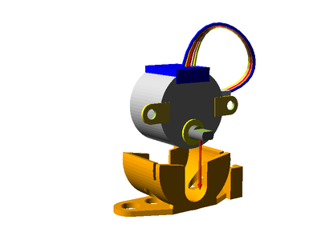
2. Push the pins into the motor clip

3. Push the wheel onto the motor shaft, then add a rubber band or o-ring to the wheel for extra grip.  You can also add a retaining grub screw if necessary.

4. Slide the stepper driver into place and plug in the cable for the motor

## Rear Caster

### Vitamins

Qty | Vitamin | Image
--- | --- | ---
1 | [16mm Marble]() |  | 

### Printed Parts

Qty | Part Name | Image
--- | --- | ---
1 | [Caster Housing](../printedparts/stl/CasterHousing.stl) |  | 

### Assembly Steps

1. Insert the marble into the printed housing

## Lid IR

### Vitamins

Qty | Vitamin | Image
--- | --- | ---
1 | [9g Micro Servo]() |  | 
1 | [Servo Horn]() |  | 
1 | [Sharp2Y0A21]() |  | 

### Printed Parts

Qty | Part Name | Image
--- | --- | ---
1 | [LidIR](../printedparts/stl/LidIR.stl) |  | 

### Assembly Steps

1. Push fit the micro servo horn into the base of the lid
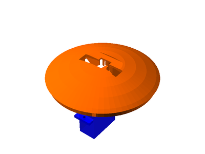
2. Fit the distance sensor into the top of the shell, threading the cable down through the lid
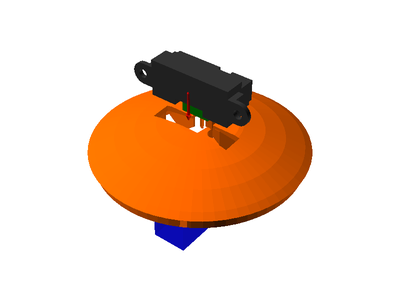

## Final Assembly

### Vitamins

Qty | Vitamin | Image
--- | --- | ---
1 | [Arduino Pro Mini Pins on top, inc serial pins]() |  | 
4 | [AA Battery]() |  | 
1 | [Battery Pack]() |  | 
1 | [Hook and Loop Tape 40x10mm]() |  | 
2 | [JumperWire Female to Female 4pin 100mm]() |  | 
6 | [JumperWire Female to None 1pin 100mm]() |  | 
4 | [JumperWire Female to None 1pin 70mm]() |  | 
4 | [JumperWire None to None 1pin 100mm]() |  | 
3 | [JumperWire None to None 1pin 50mm]() |  | 
1 | [SPST6A Mini Toggle Switch]() |  | 
1 | [2 Pole 20A Terminal Block]() |  | 

### Printed Parts

Qty | Part Name | Image
--- | --- | ---
1 | [Basic Shell](../printedparts/stl/BasicShell.stl) |  | 
2 | [BumperStabiliser](../printedparts/stl/BumperStabiliser.stl) |  | 
1 | [IR Servo Bracket](../printedparts/stl/IRServoBracket.stl) |  | 
1 | [Base](../printedparts/stl/Base.stl) |  | 
4 | [Pin Tack H14.1](../printedparts/stl/PinTackH141.stl) |  | 
1 | [Pin Tack H6.1](../printedparts/stl/PinTackH61.stl) |  | 
2 | [Pin Tack H6.5](../printedparts/stl/PinTackH65.stl) |  | 
2 | [Pro Mini Clip](../printedparts/stl/ProMiniClip.stl) |  | 

### Sub-Assemblies

Qty | Name 
--- | --- 
2 | Bumpers
1 | Left Drive Wheel
1 | Right Drive Wheel
1 | Rear Caster
1 | Lid IR

### Assembly Steps

1. Plug the Pro Mini Clips into the base and then snap the Arduino Pro Mini into them
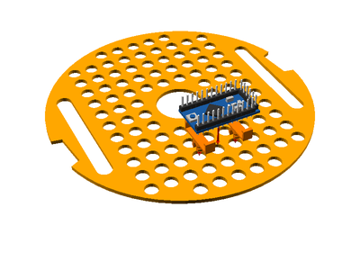
2. Connect the two bumper assemblies using four of the push pins with flat heads
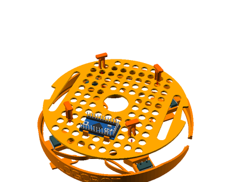
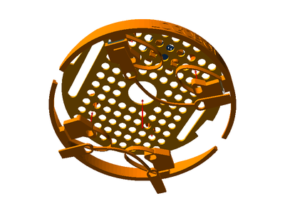
4. Plug the two wheels assemblies into the base
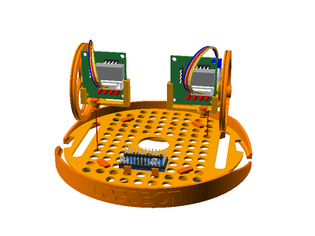
5. Connect the jumper wires between the motor drivers and the Arduino
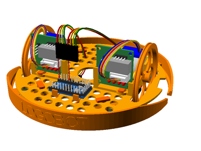
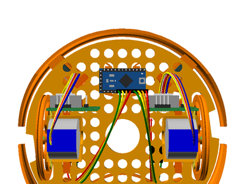
6. Fix the power toggle switch into place
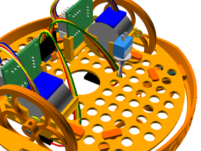
9. Align the caster assembly with the base, then insert a short pin to lock it to the base
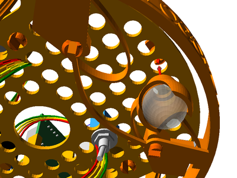
10. Fix the servo bracket assembly into place using two pins
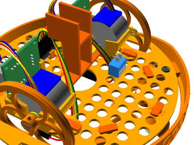
11. Attach the battery pack with self-adhesive hook and loop tape
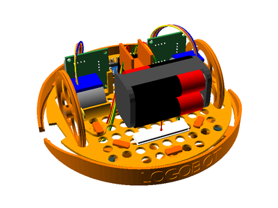
12. Wire in the terminal block to distribute power
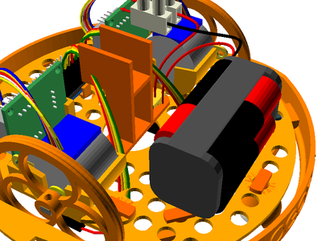
13. Wire up power to the stepper drivers and Arduino.  Then connect the microswitches to the Arduino. 
            Refer to the following wiring for Arduino pin connections: 
            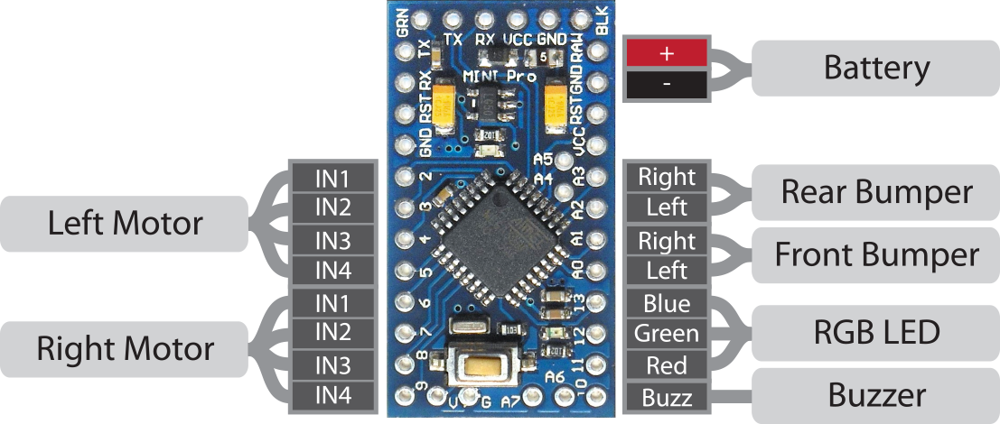
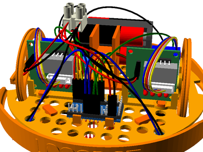
14. Push the shell down onto the base and twist to lock into place
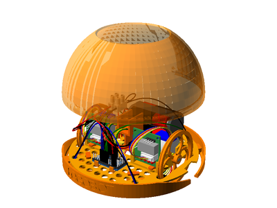
15. Push fit the servo into the bracket, thereby fixing the lid in place
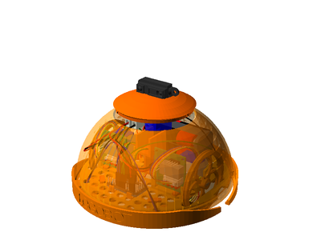

